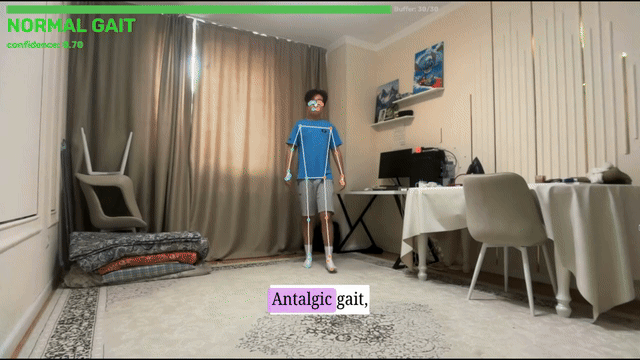

# Webcam Gait Analysis and Gesture Control

Real-time body tracking from a standard webcam detects asymmetric gait patterns associated with neurological and musculoskeletal disorders. The same architecture turns full-body movement into keyboard input, demonstrated on Subway Surfers.



YouTube demo: https://www.youtube.com/watch?v=6GBaegb5wKo

---

## Motivation

Consumer cameras can now extract 33 body landmarks at 30 frames per second on a laptop CPU. That is enough to replace a keyboard when playing a game. It is also enough to measure how symmetrically a person walks, and asymmetric gait is one of the earliest detectable signs of conditions including antalgic gait (pain-compensating limp), Trendelenburg gait (hip abductor weakness), hemiplegic gait (post-stroke one-sided weakness), Parkinsonian gait (shuffling, reduced arm swing), and scissor gait (spasticity in cerebral palsy).

Clinical gait analysis today requires a motion capture lab, trained physiotherapists, and a scheduled appointment. This project asks a simpler question: how much can you detect from a webcam and 33 landmarks?

## What Was Built

Two independent systems share the same perception pipeline.

**Part 1. Subway Surfers controller.** Lane changes are position-based: when your body center crosses a threshold in the camera frame, a left or right arrow key fires. Jump and crouch are classifier-based: a Random Forest trained on 3,892 labeled frames predicts whether your current pose is RUN, JUMP, or CROUCH, and sends the corresponding key only when confidence exceeds 0.80.

**Part 2. Gait asymmetry detector.** After 30 consecutive frames (~1 second of walking), temporal features are extracted from the landmark sequence and classified as NORMAL_GAIT or ASYMMETRIC_GAIT. Classification updates every 10 frames with majority voting over the last 5 verdicts for stability.


## Methodology

**Perception layer.** MediaPipe Pose Landmarker (v0.10.14) extracts 33 body keypoints per frame, normalized to [0,1] in image coordinates, on CPU in under 15ms per frame on an Apple M4.

**Gesture classifier, feature engineering.** Rather than feeding raw coordinates to the classifier, 22 biomechanically meaningful features are computed per frame: normalized shoulder height, torso compression ratio, average knee height, foot-to-hip distance ratio, and wrist & elbow positions.

**Gesture classifier, model.** Random Forest, 200 trees, trained on 3,892 frames (2,309 RUN, 1,405 CROUCH, 178 JUMP). Jump frames were extracted from recorded video by keeping only frames where foot landmarks were detectably above the standing baseline.

**Gait classifier, feature engineering.** 17 temporal features are computed over each 30-frame window: shoulder asymmetry mean and standard deviation, lateral hip sway, hip vertical asymmetry, left and right knee range of motion, the ratio between them, knee height difference variance, ankle and foot lift asymmetry, overall vertical body motion, and the cross-correlation between left and right knee trajectories. The cross-correlation feature directly measures whether legs are alternating correctly.

**Gait classifier, model.** Random Forest, 200 trees, trained on windowed samples from 2,938 frames of recorded walking (1,956 ASYMMETRIC_GAIT, 982 NORMAL_GAIT).

## Results

### Gesture classifier (Subway Surfers)

Trained and evaluated with 80/20 stratified split. 100% test accuracy on held-out data after replacing timed jump recording with airborne-frame extraction from video.

| Class  | Precision | Recall | F1   | Support |
|--------|-----------|--------|------|---------|
| CROUCH | 1.00      | 1.00   | 1.00 | 281     |
| JUMP   | 1.00      | 1.00   | 1.00 | 36      |
| RUN    | 1.00      | 1.00   | 1.00 | 462     |

Top features by importance: `shoulder_y_avg` (0.142), `elbow_y_avg` (0.141), `shoulder_y_norm` (0.130), `foot_y_norm` (0.092).

### Gait classifier

89.3% test accuracy on 56 windowed samples.

|                  | ASYMMETRIC | NORMAL |
|------------------|-----------|--------|
| **ASYMMETRIC**   | 35        | 3      |
| **NORMAL**       | 3         | 15     |

Top features: `hip_diff_mean` (0.296), `shoulder_asym_mean` (0.173), `shoulder_asym_std` (0.092), `knee_anticorr` (0.088). The hip vertical asymmetry feature - how much one hip drops relative to the other during walking - is the single most predictive signal, which is consistent with clinical literature on **Trendelenburg gait**.

### Honest limitations

Both models were trained exclusively on one person's body. The gesture classifier is calibrated to one room, one camera angle, and one lighting environment. The gait classifier was trained on deliberate imitation of a limp, not on real patients with diagnosed conditions. Neither model should be interpreted as a diagnostic tool. The gait result demonstrates that the feature extraction architecture detects measurable asymmetry. It does NOT demonstrate clinical validity.


## How to Run

<details>
<summary><strong>Setup and training instructions (click to expand)</strong></summary>

```bash
# Clone the repository
git clone https://github.com/enstrong/webcam-gait-analysis.git
cd webcam-gait-analysis

# Create environment and install dependencies
conda create -n pose python=3.11 -y
conda activate pose
pip install opencv-python "mediapipe==0.10.14" numpy pandas scikit-learn pynput

# NOTE: both Subway Surfers and Gait Analysis are trained entirely on my body. Skip to step 3.
# if you don't want to train on your own body and go straight to playing. Consider that it
# might not function properly due to different body shapes.

# ── Subway Surfers ──────────────────────────────────────────

# 1. Collect gesture training data
python subway-surfers/collect_data.py

# 2. Train the gesture classifier
python subway-surfers/train.py

# 3. Run the game controller
#    Focus Subway Surfers (any emulator or https://subwaysurfersgame.cc/), then move
python subway-surfers/game.py

# ── Gait Analysis ───────────────────────────────────────────

# 1. Collect gait training data
python gait/collect_gait.py

# 2. Train the gait classifier
python gait/train_gait.py

# 3. Run live gait analysis
python gait/analyze_gait.py
```
</details>

**Notes on setup.** macOS requires camera and accessibility permissions granted to Terminal (System Settings → Privacy & Security). The game controller sends global keyboard events via `pynput` — Subway Surfers must be the focused window when `game.py` is running. Both classifiers require retraining on your own body; the trained `.pkl` files are not included in the repository because they are person-specific.


## Future Work

**Clinical datasets.** Training on clinically labeled video data remains the principal limitation of this work. The GAVD (Gait Abnormality Video Dataset, 1,874 sequences) and Health&Gait (1,564 participants with AlphaPose landmarks) datasets exist for this purpose, though both require institutional data access agreements and significant preprocessing to align with MediaPipe's landmark format.

**More landmarks.** MediaPipe's 33-point model does not capture fine-grained foot rotation or toe clearance. Clinical gait analysis uses full-body marker sets with 50–100 landmarks. A custom pose estimation model trained on clinical motion capture data would provide substantially richer signal.

**Neural approaches.** The temporal window classification could be replaced with an LSTM or Transformer that processes the full sequence of landmarks rather than hand-engineered window features. This would allow the model to learn gait cycle timing directly from data rather than relying on predefined features like knee range of motion.

**Multi-game generalization.** The architecture is game-agnostic. Lane-change logic and jump/crouch detection are independent modules. Extending to a second game requires only redefining the key mapping in `game.py`.

---

## References

1. Lugaresi, C., et al. (2019). *MediaPipe: A Framework for Building Perception Pipelines.* arXiv:1906.08172.

2. Breiman, L. (2001). *Random Forests.* Machine Learning, 45(1), 5–32.

3. Maki, B. E. (1997). *Gait changes in older adults: predictors of falls or indicators of fear?* Journal of the American Geriatrics Society, 45(3), 313–320.

4. Liao, Y., et al. (2021). *A Review of Computational Approaches for Evaluation of Rehabilitation Exercises.* Computers in Biology and Medicine, 119, 103687.
